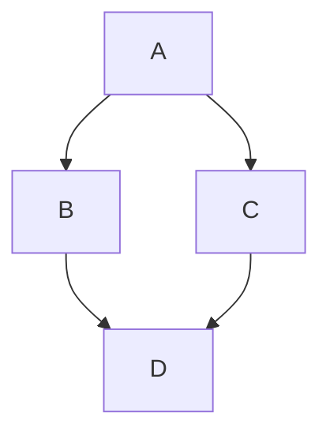
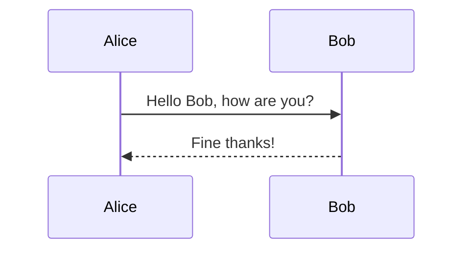
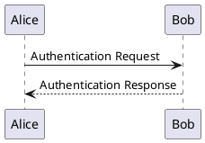
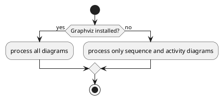

# 07 — Diagrams

muya's diagram whitelist is exactly: **mermaid**, **plantuml**, **vega-lite**,
**flowchart**, **sequence**. Any other fenced "diagram" language (kroki,
wavedrom, graphviz/dot, ditaa, vega) falls back to a plain code block.

## Mermaid



Sequence / flowchart in mermaid:



---

## PlantUML



Activity diagram:



---

## Vega-Lite (static only — interactive selections NOT supported)

```vega-lite
{
  "$schema": "https://vega.github.io/schema/vega-lite/v3.json",
  "data": { "values": [
    {"a": "A", "b": 28}, {"a": "B", "b": 55}, {"a": "C", "b": 43}
  ]},
  "mark": "bar",
  "encoding": {
    "x": {"field": "a", "type": "ordinal"},
    "y": {"field": "b", "type": "quantitative"}
  }
}
```

---

## Flowchart

```flowchart
st=>start: Start
op=>operation: Your Operation
cond=>condition: Yes or No?
e=>end

st->op->cond
cond(yes)->e
cond(no)->op
```

---

## Sequence

```sequence
Alice->Bob: Hello Bob, how are you?
Note right of Bob: Bob thinks
Bob-->Alice: I am good thanks!
```

---

## Fallback (not a muya diagram — renders as code block)

Everything below should render as plain code, NOT a diagram:

```kroki
graph TD; A-->B;
```

```wavedrom
{ signal : [ { name: "clk", wave: "p....." } ] }
```

```viz
digraph G { A -> B; B -> C; }
```
